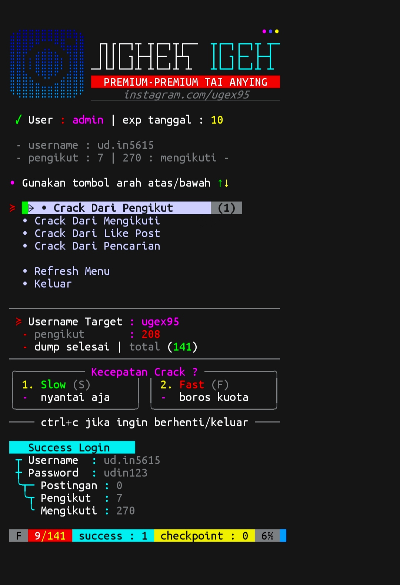

# Nghek Igeh
Menu
<br><br><br><br>
Logging
<br><br><br><br>

### Instalasi
```bash
 git clone https://github.com/Din-zUgex95/nghek-igeh
 cd nghek-igeh
 pip3 install -r requirements.txt
 ./main
```
### pengaturan
```json
{
    "settings": [
        {
            "max_dump_id": 3000,
            "max_work": 15,
            "default_crack_speed": "fast"
        }
    ]

}
```
### catatan
buka file [note.txt](note.txt) terlebih dahulu
