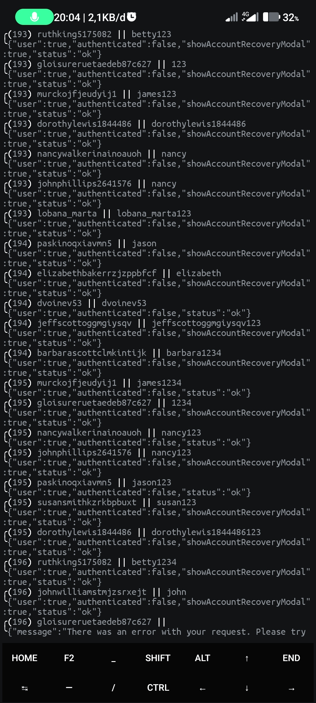

# Nghek Igeh
Menu
<br><br><br><br>
Notifikasi jika akun login berhasil
https://github.com/Din-zUgex95/nghek-igeh/blob/master/.data/notify/success.mp3?raw=true
Notifikasi jika akun login checkpoint
https://github.com/Din-zUgex95/nghek-igeh/blob/master/.data/notify/checkpoint.mp3?raw=true
<br><br>Logging
<br><br><br><br>

### Instalasi
```bash
 git clone https://github.com/Din-zUgex95/nghek-igeh
 cd nghek-igeh
 pip3 install -r requirements.txt
 ./main
```
<br><br>
### pengaturan
file [config.json](.data/config.json)
```json
{
    "settings": [
        {
            "max_dump_id": 3000,
            "max_work": 15,
            "default_crack_speed": "fast"
        }
    ]

}
```
<br><br>
### catatan
buka file [note.txt](note.txt) terlebih dahulu
<br><br><br><br>
